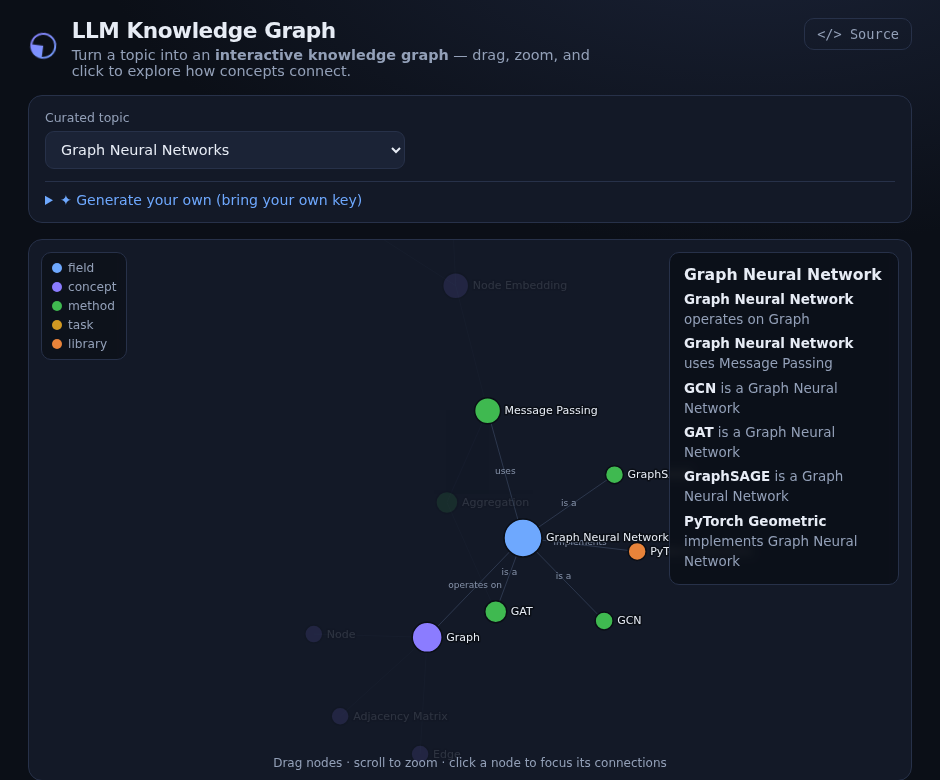

# LLM Knowledge Graph

Turn a topic into an **interactive, force-directed knowledge graph** — drag nodes, scroll to zoom, and click any node to focus its connections. Explore curated graphs instantly, or **generate your own** from an LLM with your API key.

> **Live demo:** https://tongchen2010.github.io/llm-knowledge-graph/



---

## What it does

- **Curated graphs** for several topics (Graph Neural Networks, Machine Learning, the Solar System, Photosynthesis) are built into the page, so the demo works instantly and offline.
- **Generate your own:** type any topic, paste an OpenAI API key, and the app asks an LLM to extract the entities and relationships, then renders them as a graph.
- **Interactive viz** (D3 force layout): nodes are colored and sized by type and degree; click a node to highlight its neighborhood and read off its relations; drag to rearrange; scroll to zoom.

## How the "LLM → graph" part works

`Generate` sends your topic to an LLM with a structured prompt that asks for strict JSON:

```json
{ "nodes": [{ "id": "...", "label": "...", "type": "..." }],
  "links": [{ "source": "...", "target": "...", "relation": "..." }] }
```

The response is parsed, links pointing at missing nodes are dropped, and the result is handed to the same renderer the curated graphs use. The call goes **directly from your browser** to the API — your key is never stored or proxied. (OpenAI allows direct browser calls; the key lives only in the input field.)

## Tech

- [D3](https://d3js.org/) v7 force-directed layout (loaded from a CDN as an ES module).
- Vanilla HTML/CSS/JS — no build step, no backend for the curated graphs.

## Run locally

```bash
python3 -m http.server 8000
# open http://localhost:8000/
```

## Deploy to GitHub Pages

Push to a repo, then **Settings → Pages → Deploy from a branch → `main` / `(root)`**. The `.nojekyll` file serves everything as-is.

## Privacy

Curated graphs need no network beyond loading D3. The "Generate" feature makes one request to OpenAI using the key you type; nothing is logged or sent anywhere else. To avoid keys entirely, the extraction step can be swapped for an on-device model (e.g. WebLLM / `transformers.js`).

## License

MIT © Tong Chen
